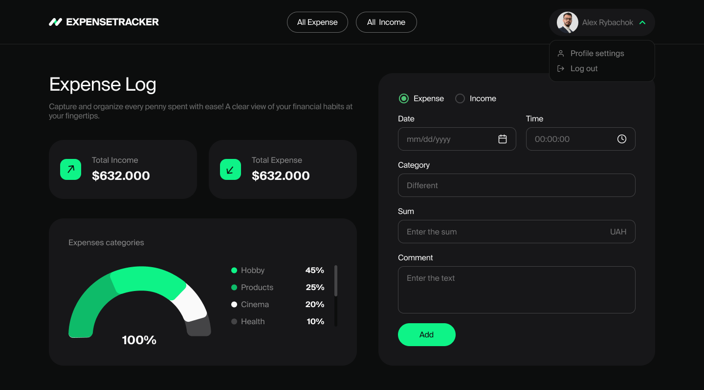
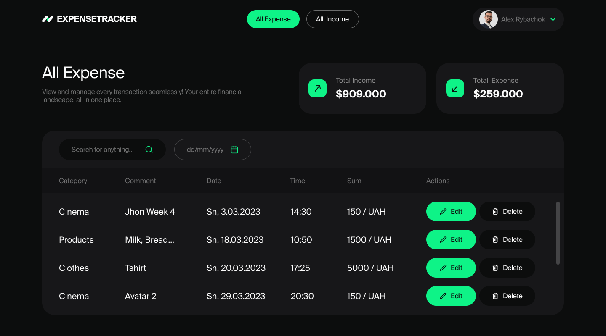

<h1 align="center">
  
</h1>

ExpenceTracker is a free React web application that helps you manage your finances and develop healthy financial habits.  Don't wait, start сontrol your money now!

  

## Why ExpenceTracker?

Free and Easy to Use: ExpenceTracker is completely free and accessible online, allowing you to access your finances anywhere, anytime.

Intuitive Interface: The user-friendly and straightforward interface makes ExpenceTracker easy to navigate even for beginners.

Powerful Features: ExpenceTracker offers a comprehensive suite of features to help you gain better control over your finances.

Secure and Reliable: ExpenceTracker utilizes cutting-edge technologies to safeguard your data.

## Under the hood
- **React**: powerful open-source front-end JavaScript library for building user interfaces based on components.
- **Redux**: for managing and centralizing application state.
- **React Hook Form**: performant, flexible and extensible forms with easy-to-use validation.
- **CSS Module**: CSS tool that bridges clear styled code.
- **Adaptive design**: user's interface adapts to different screen sizes.
- **Semantic HTML**: using HTML elements to structure content based on each element's meaning.
- **Yup**: for frontend form validation.

## Screenshots

## Demo
This project is deployed on Versel . Check it out:
[**ExpenseTracker**](https://project-capybara-66.vercel.app/)

## Contributors
This project was crafted by a team of developers.
Guys, I am very appreciative of every your commit and your hard work. 
Let's dream and make dreams come true.

    
